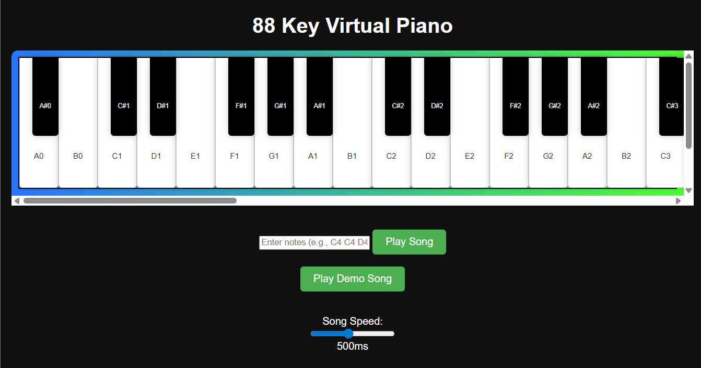

# Surya Virtual Piano

Surya Virtual Piano is a virtual piano application that allows users to play the piano directly in their browser. Experience the joy of music creation with a simple and user-friendly interface.



## Live Demo

Check out the live version of the app here: [Surya Virtual Piano](https://surya-virtual-piano.vercel.app)

## Features

- Interactive virtual piano keys
- Simple and intuitive user interface
- Responsive design, works on all devices
- Play and create music directly in the browser

## Getting Started

Follow these steps to run the project locally.

### Prerequisites

- Node.js (v14 or higher)
- npm or yarn package manager

### Installation

1. Clone the repository:

   ```bash
   git clone https://github.com/nallamothusurya/surya-virtual-piano.git
